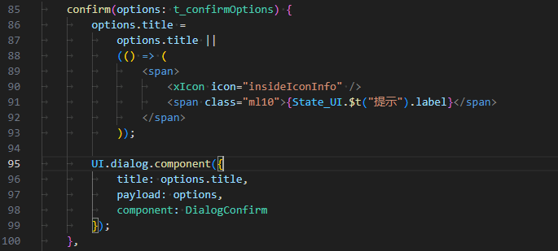

# 参考
- 使用的UI库 [ant-design-vue](https://next.antdv.com/components/overview-cn/)
- 使用的UI库 [element-plus](https://element-plus.org/zh-CN/component/button.html)
- [前端开发记录](./README.dev.md)
- [BUG记录](./README.bug.md)

## 主要功能

与yapi保持一致

## wiki 文档

用于记录
- [ ] private 私人记录

### 权限

- all：登录后所有人可见
- group
- project
- private

### dev

- [x] 文档修改日志

## i18n 管理

国际化的josn文件管理

- [相似查询](https://www.cnblogs.com/wzndkj/p/9428194.html)
本地scan i18n得到json
- json=>i18n 接口获取对应的多国语言文件的josn
- 写入本地文件

## UI.dialog

- title 除了使用字符串还可以用使用()=>vNode ,可以使用Vue组件，示例:
